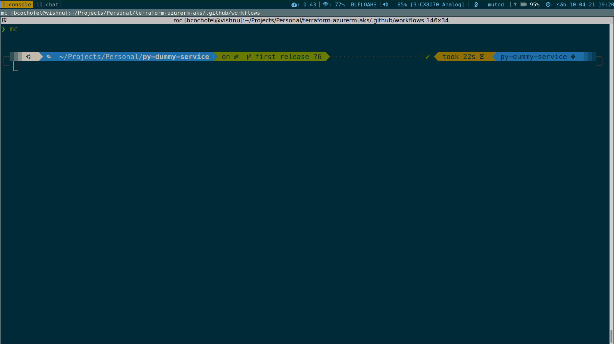

# Dotfiles for user profile



It uses the following:

- Linux terminal: terminator/kitty/tilix
- Editor: vim/neovim + plugins
- Shell: zsh + oh-my-zsh

## Install Dependencies/Packages

```bash
# Install Utilities
sudo apt-get update
sudo apt install -y imagemagick tree curl wget git unzip apt-file mc curl direnv \
  exuberant-ctags ack silversearcher-ag ripgrep golang ca-certificates age \
  gnupg traceroute net-tools make vim neovim python3 python3-pip python3-venv \
  zsh zsh-syntax-highlighting fonts-ancient-scripts fonts-powerline fonts-font-awesome \
  nodejs npm

# Install terminal emulators
sudo apt install -y terminator tilix tmux
# tilix VTE: https://gnunn1.github.io/tilix-web/manual/vteconfig/
sudo ln -s /etc/profile.d/vte-2.91.sh /etc/profile.d/vte.sh

sudo apt install pipx
pipx install checkov
pipx install pre-commit
pipx ensurepath
```

## Install dotfiles

The following method describes how you can use Git to keep track of your dotfiles.

### Start your repository from scratch

```bash
git init --bare $HOME/.dotfiles
alias gitdotfiles='/usr/bin/git --git-dir=$HOME/.dotfiles/ --work-tree=$HOME'
gitdotfiles config --local status.showUntrackedFiles no
echo "alias gitdotfiles='/usr/bin/git --git-dir=$HOME/.dotfiles/ --work-tree=$HOME'" >> $HOME/.zshrc
```

### Install your dotfiles onto a new system (or migrate to this setup)

#### Install and configure dependencies

```bash
# oh-my-zsh
sh -c "$(curl -fsSL https://raw.githubusercontent.com/ohmyzsh/ohmyzsh/master/tools/install.sh)" "" --unattended

# oh-my-zsh bullet-train theme
cd ~/.oh-my-zsh/themes/
curl -O https://raw.githubusercontent.com/caiogondim/bullet-train-oh-my-zsh-theme/master/bullet-train.zsh-theme
cd

# oh-my-zsh powerlevel10k theme
git clone --depth=1 https://github.com/romkatv/powerlevel10k.git ${ZSH_CUSTOM:-~/.oh-my-zsh/custom}/themes/powerlevel10k

# zsh-autosuggestions plugin
git clone https://github.com/zsh-users/zsh-autosuggestions ${ZSH_CUSTOM:-~/.oh-my-zsh/custom}/plugins/zsh-autosuggestions

chsh -s $(which zsh)
```

#### Clone repository

```bash
cd
alias gitdotfiles='/usr/bin/git --git-dir=$HOME/.dotfiles/ --work-tree=$HOME'
echo ".dotfiles" >> $HOME/.gitignore
git clone --bare https://github.com/bcochofel/dotfiles.git $HOME/.dotfiles
alias gitdotfiles='/usr/bin/git --git-dir=$HOME/.dotfiles/ --work-tree=$HOME'
mkdir -p ~/.config-backup
gitdotfiles checkout 2>&1 | egrep "\s+\." | awk {'print $1'} | xargs -I{} mv {} ~/.config-backup/{}
gitdotfiles checkout
gitdotfiles config --local status.showUntrackedFiles no
gitdotfiles status
```

#### Additional configuration

```bash
# update ttf fonts cache
fc-cache -f -v

# choose default terminal
sudo update-alternatives --set x-terminal-emulator /usr/bin/terminator

# install tmux plugins
tmux start-server
tmux new-session -d
~/.tmux/plugins/tpm/scripts/install_plugins.sh
tmux kill-server

# create symbolic link for neovim config
mkdir -p ~/.config/nvim
ln -s ~/.vimrc ~/.config/nvim/init.vim
```

#### Gnome Keyring

To configure `Gnome Keyring` for i3 follow [this](https://wiki.archlinux.org/index.php/GNOME/Keyring#With_a_display_manager)

## Plugin Manager

### Install Vim-Plug

[vim-plug](https://github.com/junegunn/vim-plug)

### Install Vundle

[Vundle](https://github.com/VundleVim/Vundle.vim)

## Useful plugins

### Look & Feel

- [nord-vim](https://github.com/arcticicestudio/nord-vim)
- [vim-airline](https://github.com/vim-airline/vim-airline)
- [vim-airline-themes](https://github.com/vim-airline/vim-airline-themes)
- [lightline](https://github.com/itchyny/lightline.vim)

### Utilities

- [NERDCommenter: Comment functions so powerful—no comment necessary.](https://github.com/preservim/nerdcommenter)
- [NERDTree: a file system explorer for the Vim editor.](https://github.com/preservim/nerdtree)
- [NERDTree-GIT: A plugin of NERDTree showing git status flags.](https://github.com/Xuyuanp/nerdtree-git-plugin)
- [Vista.vim: Viewer and finder for LSP symbols and tabs](https://github.com/liuchengxu/vista.vim)
- [Tagbar: a class outline viewer for Vim](https://github.com/majutsushi/tagbar)
  - Dependencies: sudo apt install exuberant-ctags
- [FZF: A command-line fuzzy finder.](https://github.com/junegunn/fzf.vim)
- [CtrlP: Full path fuzzy file, buffer, mru, tag, ... finder for Vim.](https://github.com/ctrlpvim/ctrlp.vim)
- [Vim-Indent: Indent Guides is a plugin for visually displaying indent levels in Vim.](https://github.com/nathanaelkane/vim-indent-guides)
- [SuperTab: vim plugin which allows you to use Tab for all your insert completion needs (:help ins-completion).](https://github.com/ervandew/supertab)
- [Ack: Run your favorite search tool from Vim, with an enhanced results list.](https://github.com/mileszs/ack.vim)
  - Dependencies: sudo apt install ack-grep
- [Vim-easy-alin: A simple, easy-to-use Vim alignment plugin.](https://github.com/junegunn/vim-easy-align)
- [tabular: Vim script for text filtering and alignment](https://github.com/godlygeek/tabular)
- [vim-gutentags: A Vim plugin that manages your tag files](https://github.com/ludovicchabant/vim-gutentags)
- [vim-repeat: repeat.vim: enable repeating supported plugin maps with "."](https://github.com/tpope/vim-repeat)
- [vim-swoop: It allows you to find and replace occurrences in many buffers being aware of the context.](https://github.com/pelodelfuego/vim-swoop)
- [vim-mark: Highlight several words in different colors simultaneously.](https://github.com/inkarkat/vim-mark)
- [vim-tmux-navigator: Seamless navigation between tmux panes and vim splits](https://github.com/christoomey/vim-tmux-navigator)

### General Programming

- [vim-polyglot: A solid language pack for Vim.](https://github.com/sheerun/vim-polyglot)
- [Neomake: Asynchronous linting and make framework for Neovim/Vim](https://github.com/neomake/neomake)
  - Dependencies: pip install pylint yamllint ansible-lint flake8
- [auto-pairs: Insert or delete brackets, parens, quotes in pair.](https://github.com/jiangmiao/auto-pairs)
- [Syntastic: Syntax checking hacks for vim](https://github.com/vim-syntastic/syntastic)
  - Dependencies: pip install yamllint ansible-lint
- [ALE: Check syntax in Vim asynchronously and fix files](https://github.com/dense-analysis/ale)
- [Deoplete: Dark powered asynchronous completion framework for neovim/Vim8](https://github.com/Shougo/deoplete.nvim)
  - Dependencies: pip install pynvim
- [Deoplete-jedi: deoplete.nvim source for Python](https://github.com/deoplete-plugins/deoplete-jedi)
  - Dependencies: pip install jedi
- [Neoformat: A (Neo)vim plugin for formatting code.](https://github.com/sbdchd/neoformat)
  - Dependencies: pip install autopep8 yapf docformatter
- [jedi-vim: jedi-vim - awesome Python autocompletion with VIM](https://github.com/davidhalter/jedi-vim)

### GIT

- [vim-fugitive: A Git wrapper so awesome, it should be illegal](https://github.com/tpope/vim-fugitive)
- [vim-git: Vim Git runtime files](https://github.com/tpope/vim-git)

### Tmux

- [vim-tmux-navigator: Navigation between tmux and vim](https://github.com/christoomey/vim-tmux-navigator)

### Markdown

- [vim-markdown: Markdown Vim Mode](https://github.com/plasticboy/vim-markdown)

### Terraform

- [vim-terraform: basic vim/terraform integration](https://github.com/hashivim/vim-terraform)
  - Depends: terraform binary

### Ansible

- [vim-ansible: A vim plugin for syntax highlighting Ansible's common filetypes](https://github.com/pearofducks/ansible-vim)

## References

- [i3 Window manager](https://i3wm.org/)
- [Install oh-my-zsh](https://github.com/ohmyzsh/ohmyzsh)
- [Terminator emulator](https://terminator-gtk3.readthedocs.io/en/latest/gettingstarted.html)
- [Tilix](https://gnunn1.github.io/tilix-web/)
- [Kitty](https://sw.kovidgoyal.net/kitty/)
- [Neovim](https://neovim.io/)
- [Tmux Plugin Manager](https://github.com/tmux-plugins/tpm)
- [Tmux Plugins](https://tmuxcheatsheet.com/tmux-plugins-tools/)
- [Git your dotfiles](https://www.atlassian.com/git/tutorials/dotfiles)
